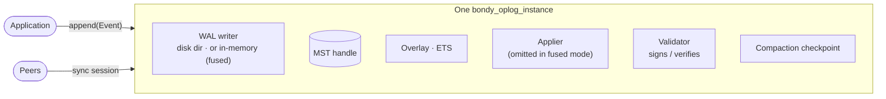
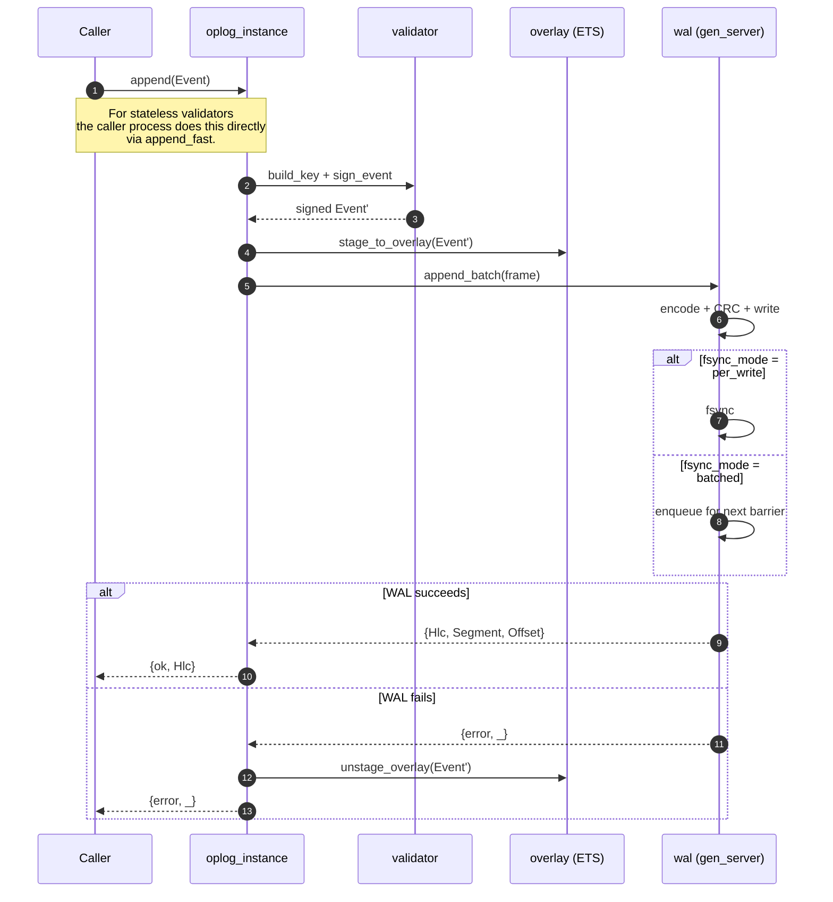
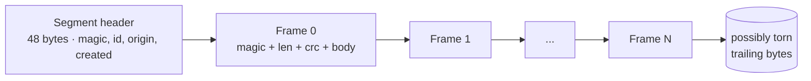
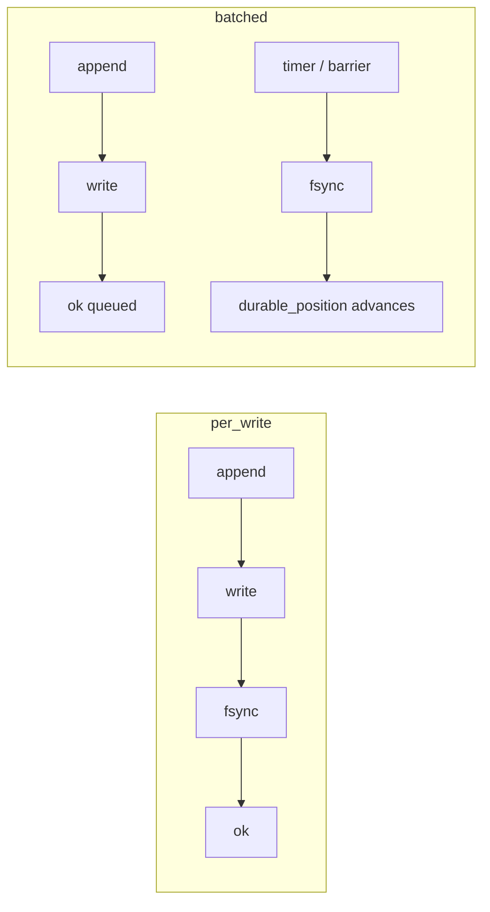
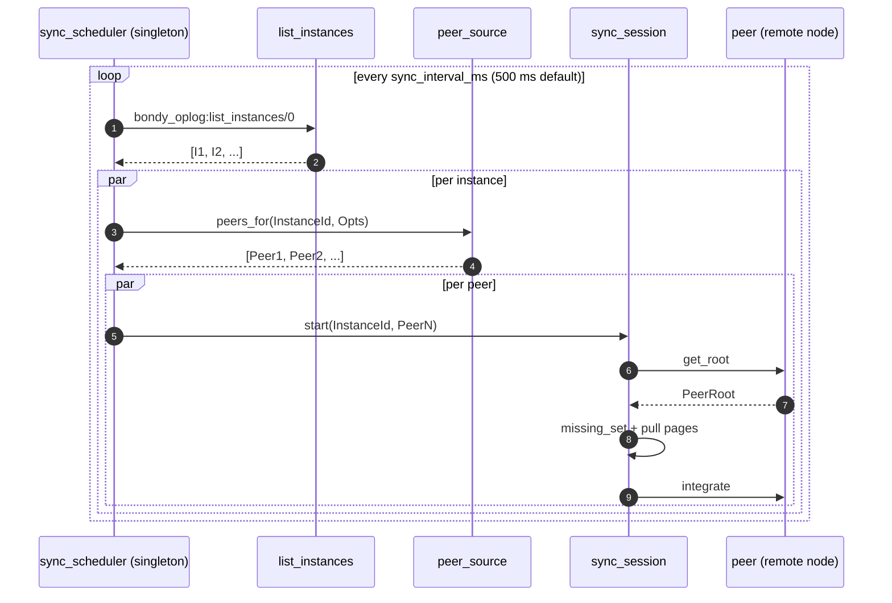
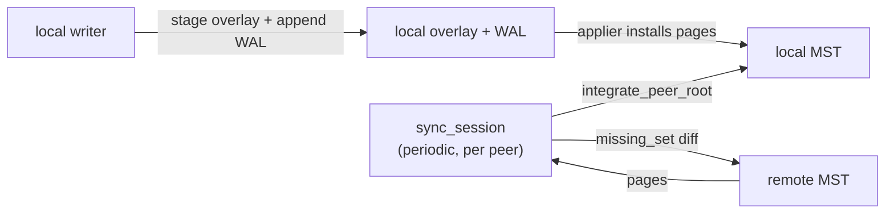
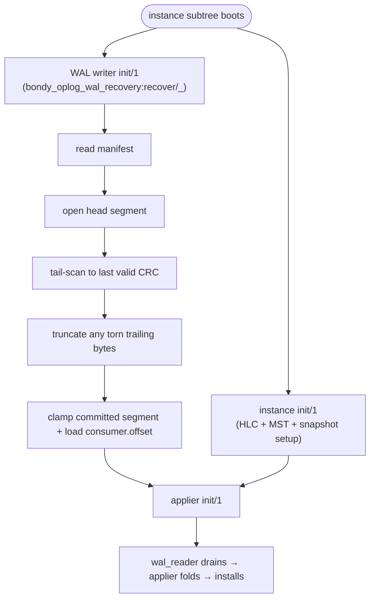
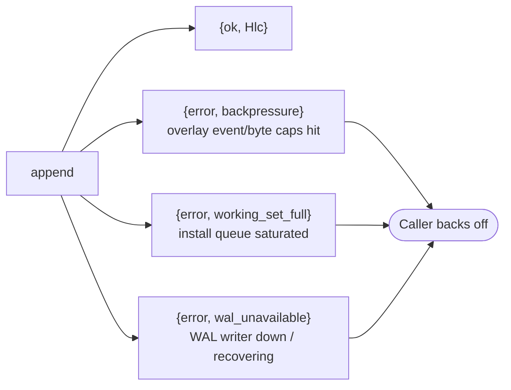
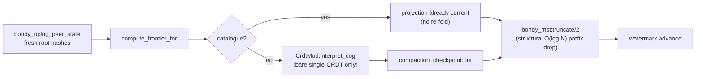

# bondy_oplog: the write side

> Audience: anyone who needs to know what happens between
> `bondy_oplog:append/2` and "this event will survive a power cut".
> Time to read: ~15 min.

In the previous chapter we said `bondy_oplog` is "the write side". Let's
unpack that. The oplog has four jobs:

1. **Frame events** into a known shape (`{HLC, Origin, Seq}` keys,
   signature, payload).
2. **Persist** them durably to a Write-Ahead Log per instance.
3. **Replicate** them to peers without a leader — via the MST.
4. **Recover** them from the WAL after a crash.

This chapter is a slow walk through each.

## The unit of work: an instance

A `bondy_oplog_instance` is the smallest replicated unit. One instance
holds one MST, one WAL, one applier (durable mode), one compaction
checkpoint. Multiple instances can run side-by-side on the same node —
they are isolated from each other.



The instance is a gen_server, but the lock-free fast paths
(`append_fast`, lock-free `get`) bypass it when the validator is
stateless. The gen_server serialises:

- stateful-validator appends (`append`, `append_many`);
- peer event installs (`install_remote`);
- MST page exchanges (`get_pages`, `merge_pages`, `missing_set`);
- compaction operations (`compact`, `truncate_prefix`,
  `load_snapshot`);
- applier sync barriers (`drain_install_queue`,
  `await_overlay_drained`) — in fused mode these are serviced by the
  instance itself between drain slices (see below).

## An event has shape

Every event carries an **event key**:

```
{HLC, Origin, Seq}
```

- **HLC** is a Hybrid Logical Clock — monotonic across a node, and
  bounded by wall-clock skew across the cluster.
- **Origin** is the 16-byte identifier of the node that authored the
  event. Two replicas can't collide because their origins differ.
- **Seq** is a per-(HLC, Origin) tiebreaker for the rare case where
  two events at the same node share an HLC tick.

The event key is the **sort key** in the MST. That is why peers can
agree on order without any consensus: order is in the data.

The event also carries an **operation** — an opaque term the
substrate never interprets or serialises itself; meaning lives in the
table's CRDT module ([chapter 05](05_crdt_model.md)) — plus optional
`meta` (the tier_2 causal context travels here) and a signature from
the validator.

## The append path



A couple of details to keep in mind:

- **The overlay is staged *before* the WAL append.** The invariant
  is "the applier can never observe a durable event without its
  overlay row". A failed WAL append rolls the overlay back via the
  instance's `unstage_overlay/2`.
- **The caller unblocks before the applier runs.** The applier is
  the process that materialises the event into the projection
  ([chapter 04](04_applier.md)). The caller's `ok` means "durable + visible in the
  overlay", not "materialised in the projection".

## The WAL on disk

One directory per instance, segments numbered with 9-digit IDs:

```
{wal_dir}/{instance_id}/
    manifest
    consumer.offset
    snapshot.watermark
    000000000.qdata
    000000000.qidx
    000000001.qdata
    000000001.qidx
    ...
```

Each segment file looks like this:



Per-frame:

```
Magic | FrameLen | CRC32 | FrameVersion | Flags | Body (list of events, ETF)
```

The frame is the unit of atomicity: a multi-event batch becomes **one
frame**. If a crash leaves a partial frame at the tail of the head
segment, recovery truncates back to the last valid CRC boundary.

The companion `.qidx` is a sparse HLC index — used by operators and by
peer sync to jump into a segment at a target HLC without scanning the
whole thing.

## Two fsync modes

The namespace declares its durability policy:

| Mode | When `{ok, _}` is returned | Use it for |
|---|---|---|
| `per_write` | After fsync. Strictly durable. | Auth-critical (grants, tickets) |
| `batched` | After enqueue. `await_durable/3` is the barrier. | High-churn (registry) |



Both are written in pure Erlang and verified by PropEr crash tests.

## Fused mode: the ephemeral fast path

A table can opt its instances into **fused mode**
(`oplog_instance_opts => #{fused => true}`, ephemeral durability).
Fused mode collapses the applier into the instance gen_server: the
instance drains its own WAL and runs the full pipeline inline —

```
drain → verify → cell-apply → MST install → publish → overlay evict
```

(`fused_apply_batch/2` in `bondy_oplog_instance.erl`, reusing the
applier's state-free stages and emitting the applier's telemetry
events, so dashboards see one uniform write path). The supervisor
omits the applier and scrubber children entirely.

The one rule that makes this safe under sustained load: **the drain
yields**. After a bounded number of batches the instance re-queues the
drain message and returns to its mailbox, so `handle_call`/`handle_cast`
traffic — compaction triggers, `integrate_peer_root` (remote
convergence!), write-ack barriers — is serviced between drain slices
rather than starved behind an unbounded drain.

### The in-memory WAL

A fused instance can additionally select `wal_backend => mem`: the
disk WAL is replaced by `bondy_oplog_wal_mem`, an ETS `ordered_set`
queue keyed by a dense monotonic sequence. There is **no fsync and no
disk I/O on the ack path** — `head == durable` at all times, and the
fused drain reads the queue via an `ets:next/2` cursor
(`bondy_oplog_wal_mem_reader`). Consumed prefixes are garbage-collected
as the drain commits; a count-based cap (`max_live_events`) provides
the same `{error, wal_full}` backpressure shape as the disk WAL.

The durability deal is explicit and **cluster-provided**: an ephemeral
table's projection and MST are already memory-only — node death loses
them regardless of WAL backend, and the data re-converges from peers
via anti-entropy. Dropping the local fsync only widens the
acked-but-not-yet-replicated loss window to include
BEAM-crash-with-disk-survival; that window is covered by AE exactly
like node death. Durable tables never enter this code path — the
supervisor only honours `wal_backend => mem` for fused instances and
falls back to disk (with a warning) otherwise.

Producers are oblivious: the mem WAL speaks the same gen_server
protocol (`append_batch`, `await_durable`, committed-position
tracking) as `bondy_oplog_wal`.

## Replication: there is no leader

The novel bit of `bondy_oplog` is **how events get from one node to
another**. Two pieces conspire:

1. The **MST** is a content-addressed structure. Two peers can
   compare roots and know in one round-trip whether they agree.
   Chapter 02 (in the bondy_mst library docs) has the details.
2. A **single node-global `bondy_oplog_sync_scheduler`** ticks every
   `sync_interval_ms` (default 500 ms). On each tick it iterates
   the locally-running instances and, per instance, asks the
   configured peer source for a small subset of peers, then spawns
   one `bondy_oplog_sync_session` per peer via the dispatch
   callback (default: `bondy_oplog_sync_session:start/3`).



The session is short-lived and asynchronous. It does not block
writes, and a failing session is just retried on the next tick.

A successful round does one more thing: it **advances the shard's
freshness signal**. Each `(NS, primary, Shard)` carries a wait-free
`ae_atomics` timestamp that `bump_ae_on_sync/2` stamps with the current
wall-clock time at the end of every completed round — including an
*empty* round, where the peer had nothing new. That heartbeat is what
lets a low-churn shard prove it is still in contact with its peers even
when no event has changed; the read side reads it as the freshness fence
([chapter 03](03_bondy_db.md)). Whether a round is allowed to certify
freshness is governed by an **isolation policy** (`refuse` / `proceed` /
`quorum`): a node that cannot reach a peer does not get to declare its
own data fresh under the default `refuse`. The policy lives here, on the
freshness-production side, so the read path stays a single atomic read.

The transport is pluggable (`bondy_oplog_transport` behaviour). Three
implementations ship: **`bondy_oplog_transport_partisan`** — the
production transport, which carries sync traffic over the same Partisan
overlay Bondy already uses for its cluster membership and messaging —
`bondy_oplog_transport_disterl` (Distributed Erlang), and
`bondy_oplog_transport_inline` (same-VM, used for tests). Bondy runs on
Partisan, not Distributed Erlang, so a Bondy deployment uses the
Partisan transport.

## Replication is anti-entropy only

Today replication is **exclusively anti-entropy** over the MST via
`bondy_oplog_sync_session`. A local append stages the overlay and
appends to the local WAL; peers learn about the event when a sync
tick walks the MST and pulls divergent pages.



A few notes:

- **Peer events do not flow through the remote WAL.** They arrive
  via the responder / sync_session and are forwarded to the
  remote instance, which stages them in the overlay; the
  receiving applier installs them into the MST + projection.
- **A future eager-push fast-path is intended.** The overlay's
  `eager_pushed` origin tag and an `enqueue_remote` hook are
  in place as the receive-side mechanism, but no sending-side
  pusher exists today. Treat sync-session cadence as the floor on
  cross-node visibility.

## Recovery on boot

What happens when a node restarts?



- Recovery runs in the WAL writer's `init/1`, not the instance's
  init.
- The manifest is small and atomic; read in sub-ms.
- The tail scan is bounded by `max_segment_bytes` (default 64 MiB);
  the worst case is "scan one segment" — tens of ms.
- After the tail is clean, the applier resumes at
  `resume_position/2` = `max(MST high-key HLC, snapshot watermark
  HLC)`. The consumer offset itself is the durability fence for
  WAL retention, not the resume cursor.
- Any events past the resume position get re-applied — CRDT
  idempotency makes that safe ([chapter 05](05_crdt_model.md)).
- **Identity survives restarts.** When `storage_path` is set and no
  explicit `origin` is configured, the supervisor loads (or persists,
  on first boot) the instance's origin from disk
  (`bondy_oplog_origin:load_or_create/1`), so recovery never rejects
  the node's own WAL segments as foreign. If the WAL would fall back
  to the per-OS-pid tmp path (identity and segments abandoned on
  restart), the supervisor logs a loud warning — configure
  `storage_path`/`wal_dir`, or declare `durability => ephemeral` to
  acknowledge it.

## Backpressure

The instance gates appends via overlay-size and WAL-availability
checks. There is no soft "hint" — appends either succeed or return
one of three error tuples (`bondy_oplog_instance.erl`):



The overlay caps (`max_overlay_events`, `max_overlay_bytes`) are
read on the hot path via atomics so the check is wait-free. Disks
fill, partitions degrade, peers fall behind — backpressure is
*signalled*, not "the system crashes".

## The oplog truncates itself

The defining property of `bondy_oplog` is that the event log does not
grow without bound. Once peers confirm they have an event, the
`bondy_oplog_gc_scheduler` (1 s default tick) calls
`bondy_oplog_compaction:compact/1` for each instance, which:

1. computes a **stability frontier** from per-peer root hashes
   (`bondy_oplog_peer_state` filters out peers older than
   `peer_timeout_ms`, default 30 s). Because the frontier is derived
   from peer-synced roots — which only ever reflect installed,
   published events — it is always at or below the installed
   watermark, so `compact/1` needs **no** overlay-drain barrier and
   runs safely under sustained write load (fused included).
2. **Catalogue (projection-backed) instances skip the re-fold
   entirely** — the projection, maintained eagerly on write, *is* the
   per-cell `interpret_cog` checkpoint. A bare single-CRDT instance
   folds the stable range through `interpret_cog/2` and persists the
   result via the **compaction checkpoint**
   (`bondy_oplog_compaction_checkpoint`; file-backed when
   `storage_path` is set, ETS otherwise).
3. atomically truncates the MST via `bondy_mst:truncate/2` — a
   **structural prefix-truncate** that walks only the left spine,
   rewrites O(log N) pages, and leaves a root byte-identical to the
   equivalent per-key deletes — and advances the watermark.



At full quiescence the live MST is empty; new replicas bootstrap from
the checkpoint (or, for catalogues, the catalogue snapshot protocol)
via `bondy_oplog_sync_session` instead of replaying history.
[Chapter 06](06_compaction_and_bootstrap.md) walks through the full
lifecycle.

## Things to keep in mind

- **One writer per WAL.** No locking, no contention.
- **Events are signed.** The validator is the gateway for both local
  appends and peer-received events ([chapter 04](04_applier.md)).
- **WAL ≠ replication log.** The WAL is **per-node**; the MST is the
  replication structure. Peers don't replay each other's WALs.
- **The overlay is the read-your-writes primitive.** Without it,
  every read would block on the applier.
- **The MST is bounded.** Compaction physically deletes stable
  events; the live MST is a *window*, not a log ([chapter 06](06_compaction_and_bootstrap.md)).

## Pointers

Implementation:

- `bondy_oplog.erl` — the facade.
- `bondy_oplog_instance.erl` — the gen_server; lock-free fast
  paths, stateful-validator slow paths, `integrate_peer_root`,
  overlay staging; `fused_apply_batch/2` and the yielding fused
  drain.
- `bondy_oplog_wal.erl` — WAL gen_server: `append_batch/2`,
  `await_durable/3`, `set_committed_segment/2`. (The consumer offset
  is persisted by `bondy_oplog_wal_state:write_consumer_offset/2`.)
- `bondy_oplog_wal_mem.erl` + `bondy_oplog_wal_mem_reader.erl` —
  the in-memory (ETS) WAL backend for fused ephemeral instances.
- `bondy_oplog_origin.erl` — origin persistence under
  `storage_path` (`load_or_create/1`).
- `bondy_oplog_path.erl` — per-instance on-disk directory layout
  (`flat` | `sharded`, selected by the `path_layout` option).
- `bondy_oplog_compaction_checkpoint.erl` (+ `_ets` / `_file`) —
  the compaction checkpoint behaviour and backends.
- `bondy_oplog_wal_recovery.erl` — boot-time tail scan + manifest
  reconciliation.
- `bondy_oplog_wal_frame.erl`, `_segment.erl`, `_idx.erl`,
  `_manifest.erl`, `_codec.erl` — on-disk format.
- `bondy_oplog_sync_scheduler.erl` — single global scheduler;
  `run_tick/1`, `dispatch_for/2`.
- `bondy_oplog_sync_session.erl` — `run/3`, `bootstrap/3`,
  `pull_until_complete`; `bump_ae_on_sync/2` and
  `maybe_bump_ae_isolated/1` (the per-round freshness heartbeat) and
  `should_certify_freshness/1` (the isolation policy).
- `bondy_oplog_transport.erl` (+ `_partisan.erl` / `_disterl.erl` /
  `_inline.erl`) — the transport behaviour and its three
  implementations; Bondy uses the Partisan transport.
- `bondy_oplog_validator.erl` (+ `_crypto.erl` / `_trust.erl`).
