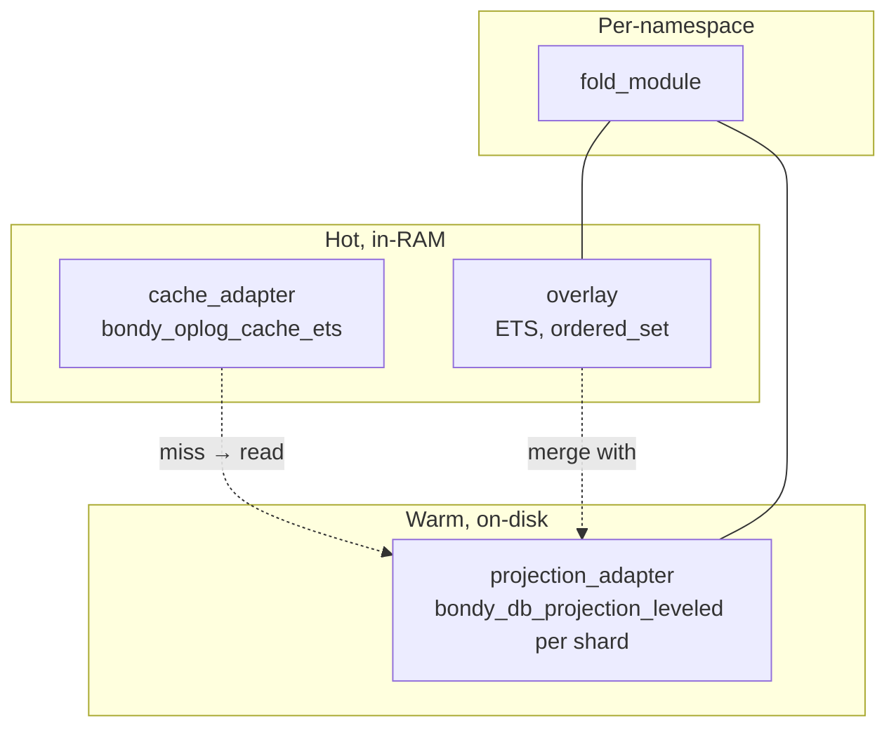
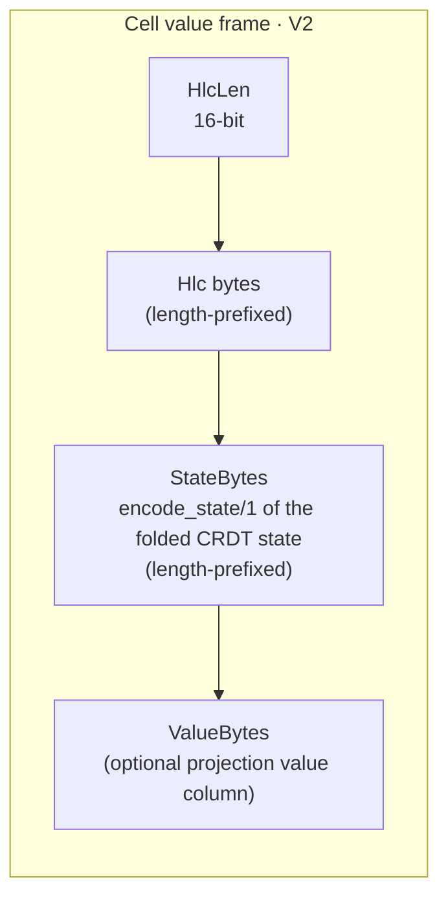
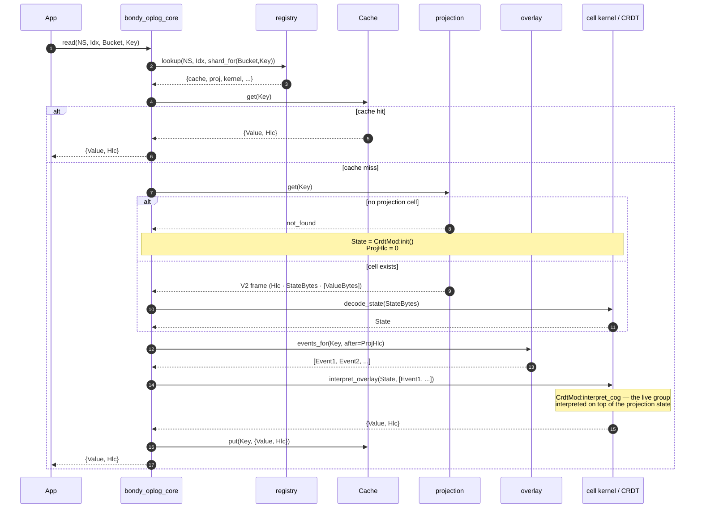
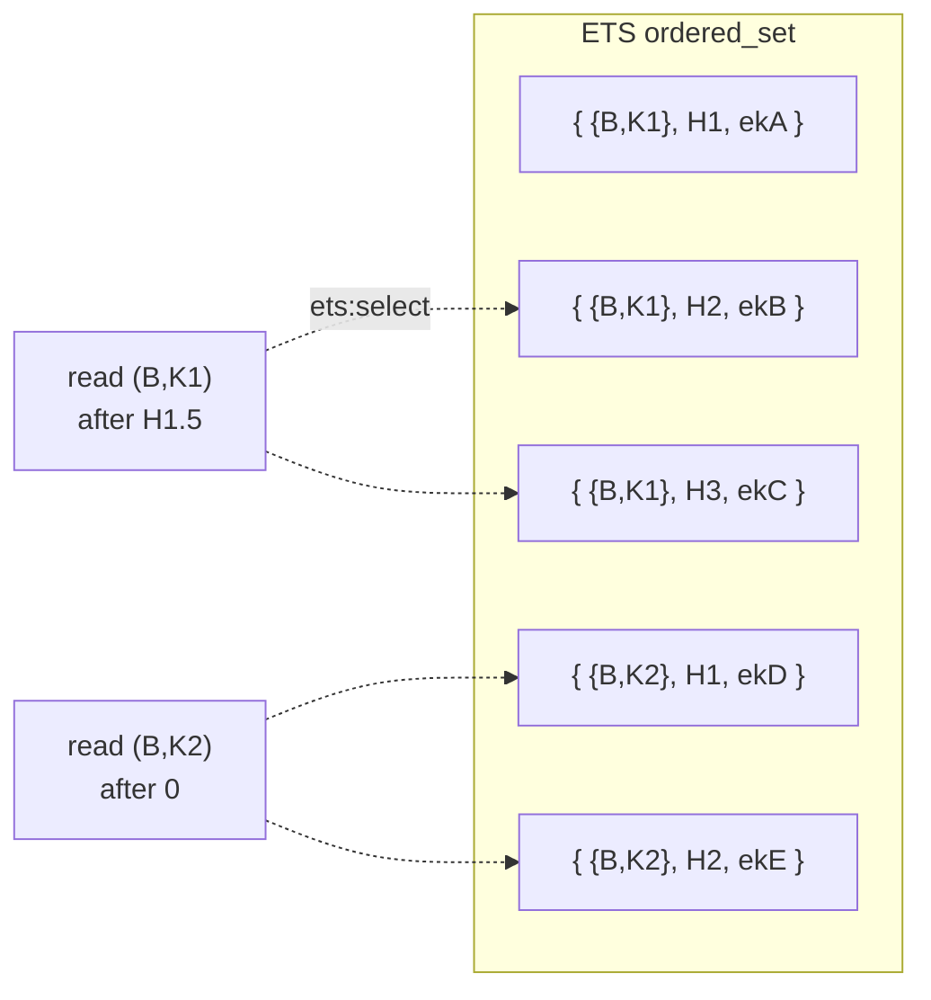
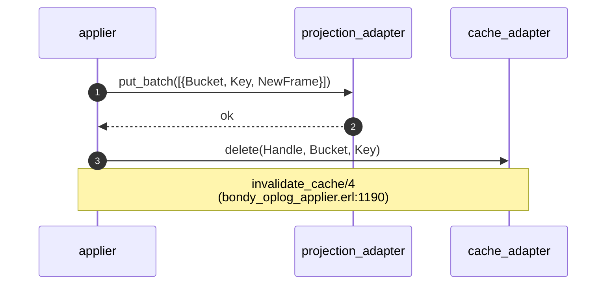
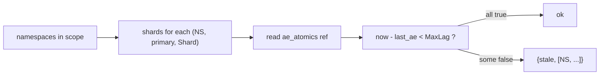
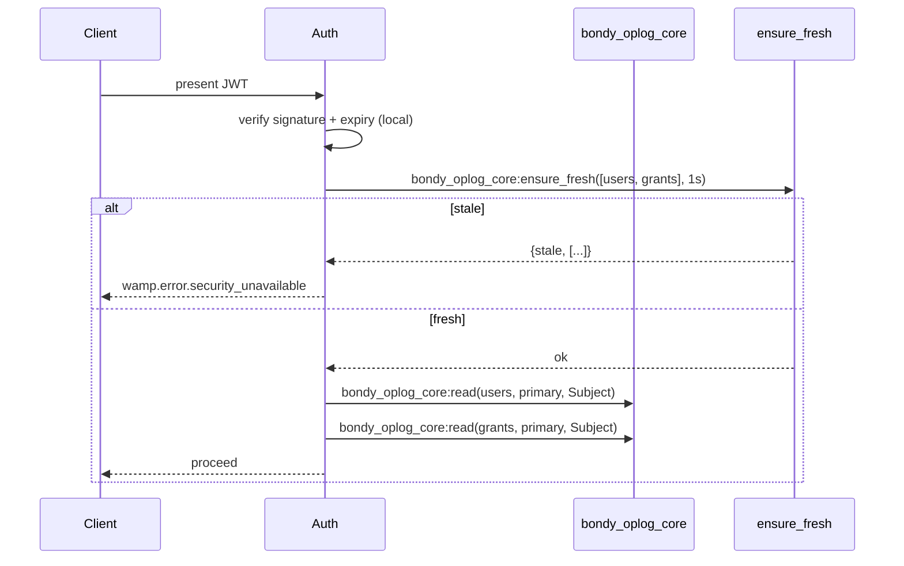
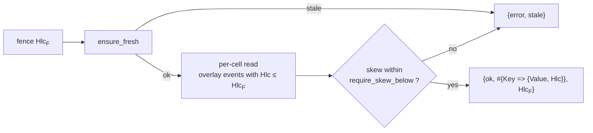
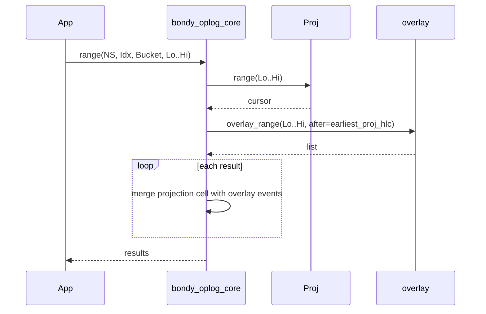
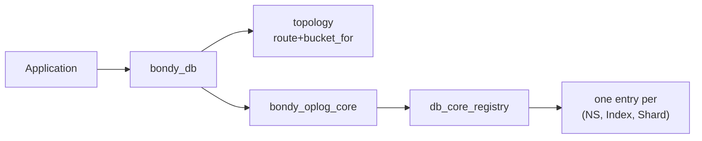

# bondy_db: the read side

> Audience: anyone who needs to know how `bondy_db:read/3` turns into a
> nanosecond.
> Time to read: ~15 min.

`bondy_db` is the consumer-facing reader. Applications never read from
the oplog directly — they go through `bondy_db`, which composes three
storage tiers (cache, overlay, projection) and a per-namespace fold
strategy into a single, predictable read API.

The substrate-level primitive is `bondy_oplog_core`; `bondy_db` is the
thin facade that adds Bondy-style tables, realms, and topology. Both
live in this package.

## The mental model: three tiers



- **Cache** is the read-after-first-read fast path. A hit returns
  `{Value, Hlc}` without touching the LSM.
- **Overlay** is the "events not yet folded into the LSM" buffer.
  Without it, every read after a write would block on the applier.
- **Projection** is the materialised state — one cell per
  `(Bucket, Key)`, value is `<<HlcLen:16, Hlc/binary, FoldedValue>>`.

The **CRDT module** is what gives the read its semantics.
[Chapter 05](05_crdt_model.md) covers the contract in detail; here,
just note that the read path interprets the overlay's live group of
pending events *on top of* the projection state through the CRDT's
own `interpret_cog/2` (via
`bondy_oplog_cell_kernel:interpret_overlay/4`) — a group
interpretation, never a per-event state fold.

## What a cell looks like

A projection cell value, on disk:



The HLC is **always present**. Reads return `{Value, Hlc}`, period.
Causality is exposed, not synthesized. This is the load-bearing
choice that lets multi-cell reads detect skew without any cluster
coordination.

## Following a read



The slow path is "one LSM get + one group interpretation" — typically
a couple of microseconds. The cache hit is sub-microsecond.

## The overlay, in pictures

> Note: the **`bondy_db` facade** provisions every shard with `overlay =>
> disabled`, so facade reads do **not** merge an overlay — read-your-writes
> comes from `apply/4`'s `await_apply` step. The overlay-merge read path
> described here is a `bondy_oplog_core` capability used by non-facade consumers
> (and configs that enable it).

The overlay key shape is the trick:

```
{{Bucket, Key}, EventHlc, EventKey}
       ^             ^         ^
       |             |         full event key (Hlc, Origin, Seq)
       |             orders within a (Bucket, Key) by HLC
       composite cell key — Bucket + Key, not a single token
```

This means `ets:select` can answer "give me all events for
`(Bucket, Key)` with HLC > T, in HLC order" in one match-spec — no
per-key linear scans, no sorting in Erlang
(`bondy_oplog_db_overlay.erl:111`, match-specs at lines 124-129,
146-155, 173-183).



The instance (not the applier) evicts overlay rows per-event after
the install batch completes — the overlay stays bounded
(`bondy_oplog_instance.erl:evict_overlay_batch/2`).

## Cache invalidation

The cache is kept coherent via **invalidate-on-commit**: after the
applier writes a projection cell, it explicitly evicts the cache
entry for that `(Bucket, Key)` so the next read repopulates from the
projection.



There is also an optional **write-through warmth** path,
`bondy_oplog_core:write_through/5`, that an application can call to
populate the cache directly for known hot keys. It only touches the
cache; the projection itself is still written by the applier.
Today's `bondy_db` facade does not use it.

## The freshness fence

Reads can be **causal** when they need to be. The substrate exposes a
wall-clock predicate on `bondy_oplog_core`:

```erlang
bondy_oplog_core:ensure_fresh([users, grants], milliseconds(1000)).
```

Each `(NS, Index, Shard)` triple registers an **`ae_atomics`** ref
(a one-element atomics array; see `bondy_oplog_core_registry.erl`),
bumped to a monotonic-ms timestamp every time the applier completes
an AE round for that shard (`bump_ae/3`). The predicate is
wait-free: read the atomic, subtract from `now`, compare to MaxLag.



This is the load-bearing primitive for security consistency. The
auth path is:



Crucially, the predicate is **independent of the projection that
might be stale**. Whether or not the projection has been updated,
the `ae_atomics` timestamp tells you when the shard last completed
a full anti-entropy round with its peers.

## `read_batch/2` — atomic-as-of-fence reads

When the application needs multiple cells at a common point in time:

```erlang
bondy_oplog_core:read_batch(
    %% batch keys are {Namespace, Index, Bucket, Key}
    [{users, primary, Realm, U1}, {grants, primary, Realm, U1}],
    #{fence => hlc:now(),
      max_lag => milliseconds(100),
      consistency => causal,
      require_skew_below => milliseconds(50)}
).
```

Semantics (`bondy_oplog_core:read_batch/2`):



- Every read in the batch sees the **same upper bound**.
- The caller observes per-cell HLCs and can compute skew.
- This is *consistent-as-of-now* with skew detection — not
  MVCC-as-of-historical-T.

## Secondary indexes

Secondary indexes are **wired**. A table opened with `indexes =>
[Spec]` gets, per declared index, a term-sharded ETS keyspace that
answers "which primary keys have term `T`?" without scanning and
decoding every value.

```erlang
{ok, Users} = bondy_db:open_table(Db, users, #{
    fold_module => lww_register,
    indexes => [#{
        name      => by_status,
        extract   => [status],      %% field path into the value
        normalize => downcase,
        projects  => [name, status] %% denormalised columns (optional)
    }]
}),
%% ... apply some writes, then:
{ok, Rows} = bondy_db:index_get(Users, <<"acme">>, by_status, <<"active">>, #{}),
%% Rows :: [{PrimaryKey, ColumnsMap}]
```

**Always ETS, always rebuildable.** An index is *never* persisted —
regardless of the namespace's projection backend it lives in RAM and
is rebuilt from the primary on every cold start (a mandatory startup
backfill). It is a deterministic function of the primary MST, so the
authoritative copy is always the primary and the index is a disposable
accelerator. This also sidesteps leveled's native 2i, which is
incompatible with the `head_only` write mode the durable projection
uses (see `MST_DB_DESIGN.md` §13).

**Term-sharded.** Each index is its own shard-set under
`(NS, IndexName, SecShard)`, sharded by `phash2({SecBucket, Term},
SecShardCount)`. An equality read (`index_get/5`) hits exactly one
shard; a range read (`index_range/6`) scatters across all of them and
merges into one globally `(term, primary-key)`-ordered list (terms span
every shard).

**Asynchronous writer + lag fence.** The primary applier computes the
old→new term diff for free — it already decoded both values — and after
the primary write commits it casts the index ops to a per-shard
`bondy_oplog_secondary_writer`. The writer batches, coalesces, and
read-modify-writes each touched index cell through the `index_entry`
fold (LWW-over-presence keyed by the primary's HLC, so an out-of-order
local-drain-vs-peer-replay delivery still converges). Because the write
is asynchronous, an index can lag the primary; reads can fence on it:

- `index_get(.., #{max_lag => Ms})` refuses with
  `{error, {stale_secondary, IndexName, Lag}}` if the touched shard
  was not freshened within `Ms` (`Lag` is the ms lag, or `infinity`
  when never freshened or flagged for rebuild).
- `#{fallback => primary}` instead scans the primary directly and
  recomputes the matching keys (slow but always correct).

**Back-pressure + self-healing.** Each shard carries an in-flight
atomic; if a hot shard's backlog would exceed its `max_inflight` cap
the applier *drops* the batch, marks the shard `needs_rebuild`, and
asks `bondy_oplog_index_rebuild` to re-materialise it from the primary
MST. The same rebuild path runs on a writer crash and at startup
(backfill). Memory stays bounded and correctness is preserved: the
index is rebuildable, and stale reads refuse until it catches up.
`bondy_db:rebuild_index/2` exposes the rebuild for operators;
`bondy_db:index_lag/2` reports per-shard `{lag, inflight,
needs_rebuild}`.

## Range scans



Ranges respect the same fold contract as point reads, only batched.

## Topology and the registry

`bondy_db` (the consumer facade, above `bondy_oplog_core`) introduces:

- **Tables** — like SQL tables but realm-scoped.
- **Topologies** — pluggable strategies for which Bookie owns which
  shard. Three ship: `bondy_db_topology_single_bookie`,
  `bondy_db_topology_per_entity`,
  `bondy_db_topology_shared_shards`. The leveled-backed three share
  their Bookie/directory plumbing via
  `bondy_db_topology_leveled_common`.



The registry entry per `(NS, Index, Shard)` carries:

- `projection_adapter` + `projection_handle` — published by the
  **shard owner** (typically `bondy_db:provision_shard/9`) at
  open time, not by the applier itself.
- `cache_adapter` + `cache_handle` — same.
- `overlay` — the per-instance ETS overlay tid.
- `crdt_module` — the per-table CRDT ([chapter 05](05_crdt_model.md));
  a legacy `fold_module` label resolves to its native twin.
- `ae_atomics` — the wait-free freshness ref read by
  `ensure_fresh/2` and bumped by `bump_ae/3` after each AE round.
- For secondary-index shards, additionally a `writer_pid` and an
  `inflight_ref` (the in-flight counter + `needs_rebuild` flag);
  primary shards carry an `instance_id` so a rebuild can find the
  applier to re-fold.

The applier reads the registry at init to resolve its
`cell_apply_target` — the (projection, cache, fold, overlay) tuple
it writes through on every event.

## Projection backend: durable vs ephemeral

The registry entry's `projection_adapter` is chosen **per table** from
`open_table`'s `projection_backend` option:

- `leveled` (default) — the durable path. The topology's `route/2`
  hands back a Bookie handle; state survives restart and is the source
  of truth on a cold start.
- `ets` — an in-RAM projection (`bondy_oplog_projection_ets`). Nothing
  is persisted; the table starts empty and reconverges from peer
  anti-entropy.

`ets` alone only makes a table **ephemeral** if the *whole* stack is
in-memory — the MST store and the WAL too. Otherwise WAL replay would
resurrect dead entries on restart. The **caller assembles** that stack
from three independent keys: `projection_backend => ets` +
`oplog_instance_opts => #{backend => ets}` (in-memory MST) + no
`storage_path` anywhere in the cascade. `durability => ephemeral` is the
explicit acknowledgement of that intent — it does not enforce the bundle;
it only silences the "no durable storage" warning the missing
`storage_path` would otherwise log. The WAL still writes to a per-PID
tmp path (`/tmp/bondy_oplog_wal/<os_pid>/…`); what makes it
restart-safe is that the path is `os:getpid()`-namespaced, so a fresh
BEAM never replays the prior run's segments — not that the WAL is
non-durable within a run.

This is what ephemeral namespaces need: WAMP registrations and
subscriptions die with the node's transport connections, so persisting
them would only resurrect dead, unroutable entries on restart. An
ephemeral table starts empty after a restart and rebuilds its live
state from peers — never from disk.

Backends can be mixed within one DB — a durable `leveled` table and an
ephemeral `ets` table coexist under the same topology
(`bondy_db_topology_memory` is itself a DB-scoped ETS provider for the
ephemeral case).

### Fused ephemeral tables

An ephemeral table can additionally opt into **fused mode** —
`open_table(Db, Name, #{fused => true, …})` — which collapses each
shard's applier into its instance gen_server, and optionally swap the
WAL for the in-memory backend
(`oplog_instance_opts => #{wal_backend => mem}`), eliminating disk
I/O from the write path entirely. This is the high-throughput
configuration for registration/subscription-style tables; durability
is cluster-provided via anti-entropy exactly as for any ephemeral
table. The mechanics live in [chapter 01](01_bondy_oplog.md); the
read/write API here is unchanged.

## Things to keep in mind

- **Reads are lock-free.** Cache hit is ETS read. Cache miss is one
  Leveled get + a tiny overlay fold.
- **HLC is always returned.** Causality is part of the API.
- **Bounded staleness is a per-shard concern.** `ensure_fresh/2`
  reads the per-shard `ae_atomics` ref; auth namespaces declare it
  required, routing namespaces don't.
- **The applier is the only writer to the projection.** Readers
  share that handle through the registry.
- **Cache coherence is by invalidation.** The applier deletes the
  cache entry after each projection write; the next read
  repopulates.
- **Secondary indexes are wired.** A table's `indexes => [Spec]`
  provisions term-sharded ETS index shard-sets fed by an async
  `bondy_oplog_secondary_writer`; reads go through `index_get/5` /
  `index_range/6` with a `max_lag` fence. They are never persisted —
  always rebuilt from the primary.
- **Writes can be packed.** A single write to a Map (or set) cell may
  carry many commands: `apply_batch/4` packs `[{put, F, V}, {rmv, F},
  …]` (or the `map_update/4` `#{put => …, rmv => …}` sugar) into one
  `{batch, Ops}` event — one WAL/MST entry, one projection
  read-modify-write, applied atomically. Only the dot-store / grow-set
  CRDTs are batchable; counters and registers are refused. See
  [The CRDT model](05_crdt_model.md#batched-operations-packing-many-commands).

## Pointers

Implementation:

- `bondy_db.erl` — the consumer facade (tables, realms, topology).
- `bondy_oplog_core.erl` — substrate read API: `read/3`,
  `read_batch/2`, `ensure_fresh/2`, `range/4`, `write_through/5`.
- `bondy_oplog_core_registry.erl` — per-(NS, Index, Shard) handle
  store + `bump_ae/3`.
- `bondy_db_topology_single_bookie.erl`,
  `bondy_db_topology_per_entity.erl`,
  `bondy_db_topology_shared_shards.erl` — three ship-with
  topologies; shared leveled/Bookie plumbing lives in
  `bondy_db_topology_leveled_common.erl`.
- `bondy_oplog_db_overlay.erl` — `{{Bucket, Key}, EventHlc, EventKey}`
  ETS overlay with match-spec range reads.
- `bondy_oplog_cache_adapter.erl` + `bondy_oplog_cache_ets.erl`
  — cache behaviour and the single ETS implementation.
- `bondy_oplog_projection_adapter.erl` +
  `bondy_db_projection_leveled.erl` /
  `bondy_oplog_projection_ets.erl` — durable (Leveled) and ephemeral
  (in-RAM) projections.
- `bondy_db_topology_memory.erl` — DB-scoped ETS projection provider
  for ephemeral tables.
- `bondy_oplog_cell_frame.erl` — V2 cell encoding:
  `<<HlcLen:16, HlcBin, StateBytes (length-prefixed), ValueBytes>>`.

Secondary indexes:

- `bondy_oplog_index_spec.erl` — declarative index spec (extract,
  normalize, projects, `max_lag`, `max_inflight`).
- `bondy_oplog_index_key.erl` — order-preserving `(Term, PrimaryKey)`
  composite-key codec.
- `bondy_oplog_crdt_index_entry.erl` — the `index_entry` CRDT
  (apply ≡ merge LWW keyed by the primary HLC;
  `value_equals_state`).
- `bondy_oplog_secondary_writer.erl` + `bondy_oplog_secondary_sup.erl`
  — per-(NS, Index, Shard) async writer and its supervisor.
- `bondy_oplog_index_rebuild.erl` — serialised MST-replay rebuild /
  backfill orchestrator.
