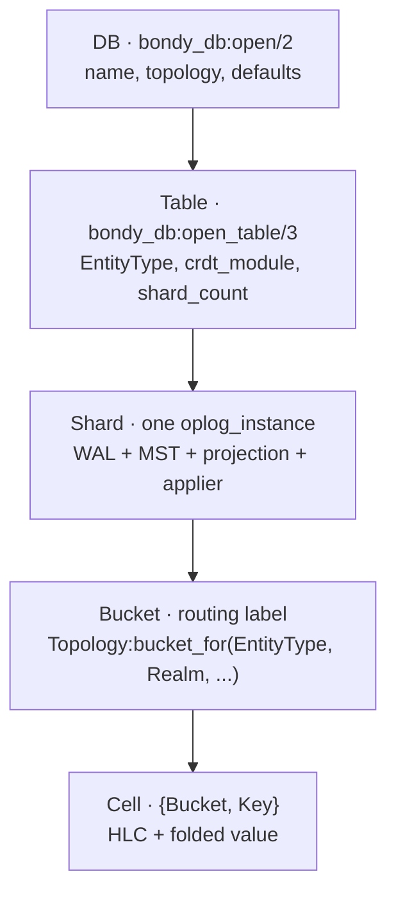
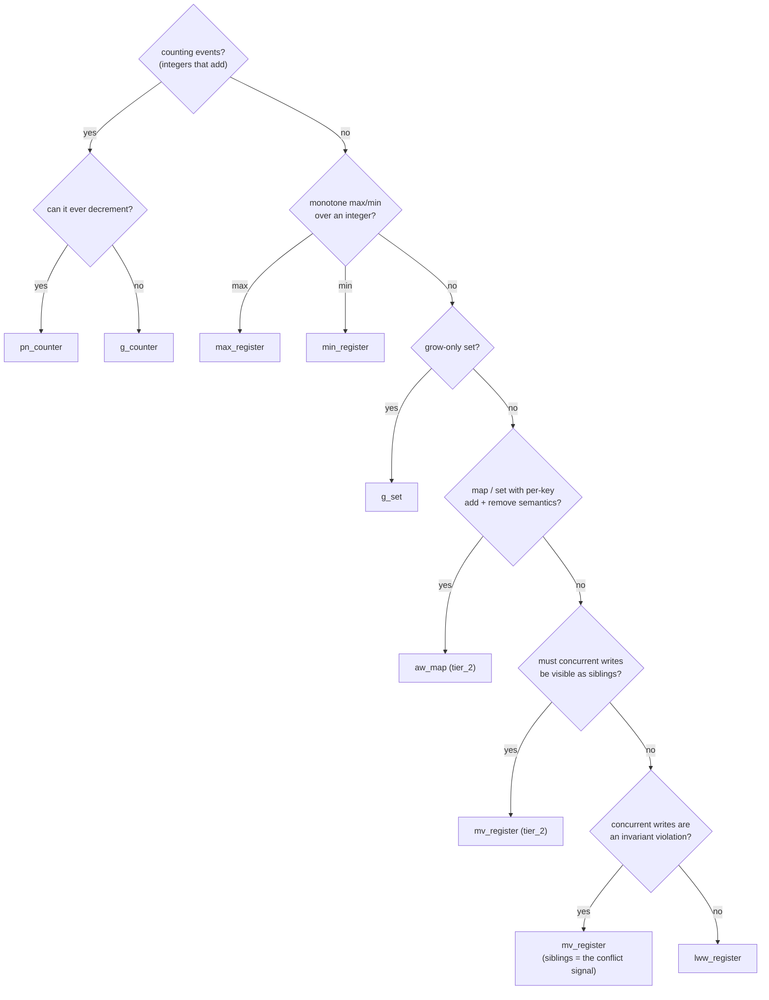
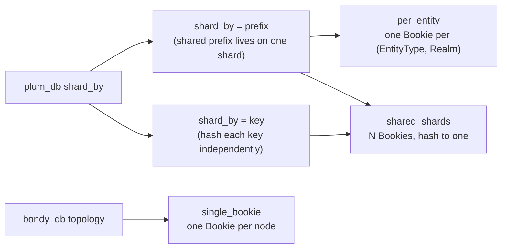
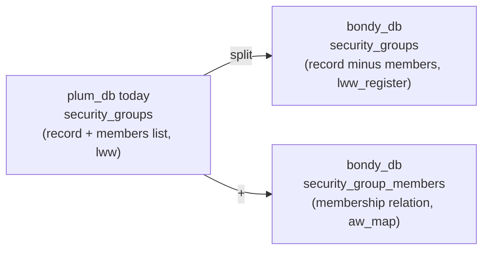

# An app developer's tour

> Audience: anyone designing a schema on top of `bondy_db`.
> Time to read: ~25 min.
> Premise: by the end you'll have mapped your domain onto a small
> set of tables, with a CRDT per table and a topology per cluster.

The previous chapters walked through the substrate from the inside.
This one walks through it from your end of the API. The question we
answer: **given a piece of state you want to replicate, how do you
turn it into a `bondy_db` table?**

We use the twelve tables Bondy Router maintains today as the worked
example. By the end, every table will have a one-paragraph
justification for its CRDT and its topology.

## 1. The model, in one picture



Two API surfaces sit above this:

- **`bondy_db`** — the consumer-facing facade. You call
  `open_table/3`, `read/3`, and `apply/4` (plus `counter_inc/4`,
  `apply_batch/4`, `map_update/4`) with table-handle maps. Each
  table is a [namespace](05_crdt_model.md).
- **`bondy_oplog_core`** — the substrate primitive
  ([chapter 03](03_bondy_db.md)). It takes `(NS, Index, Key)` and
  exposes the freshness fence (`ensure_fresh/2`), batch reads
  (`read_batch/2`), and the registry.

App code mostly uses `bondy_db`. `bondy_oplog_core` shows up when you
need `ensure_fresh/2` (auth paths) or `read_batch/2` (multi-cell
atomic-as-of-fence reads).

The single most important rule of this tutorial is one sentence:

> **The CRDT attaches to Table.** Two pieces of data that need
> different merge semantics are two tables.

Everything else in this chapter is a consequence of that rule.

## 2. Picking a CRDT

`bondy_db` ships a small catalogue of native operation-based CRDTs
(see [chapter 05](05_crdt_model.md)). Reframed by "what does the data
look like":



If you are migrating from a fold-era table, the retired types map
onto survivors like this (a `fold_module` label with a twin still
works unchanged — it resolves to the byte-identical native CRDT):

| retired (no twin) | use instead |
|---|---|
| `presence_basic` | `lww_register` (presence is a register write) |
| `ttl_presence` | `lww_register` + application-level expiry |
| `orset` | `aw_map` (observed-remove, done causally right) |
| `strict_register` | `mv_register` (concurrent writes surface as siblings the app resolves); same-event-key duplicates already crash loudly via the substrate's fixed strict-uniqueness collision rule |
| `map_of_fields` | `aw_map` (per-key sub-values) or one `lww_register` cell per field |

A few practical notes:

- **`lww_register` covers the common case.** If your code already
  reads-modifies-writes the whole record, `lww_register` matches
  that shape exactly. Don't reach for `aw_map` until concurrent
  per-key edits are an actual problem.
- **Conflict-surfacing is for invariants, not for performance.**
  Where two concurrent writes mean someone broke a rule
  (authorisation grants, single-policy registrations), use
  `mv_register` — the siblings *are* the conflict signal, and your
  handler decides what to do. (Same-*event-key* duplicates — which
  indicate a bug or tampering, not concurrency — already crash
  loudly via the substrate's default strict-uniqueness merge
  strategy.)
- **Sets and maps with removal belong in `aw_map`, in their own
  table.** A set living inside an `lww_register` record is the
  "members-in-record" anti-pattern — members get clobbered by
  whole-record LWW.
- **`mv_register` is for when losing a concurrent write is worse
  than seeing two.** Reads return *all* siblings; the application
  resolves. It is tier_2 — it pays for a causal context per cell.
- **Quantity CRDTs are for *quantities*, not records.**
  `pn_counter`, `g_counter`, `max_register`, `min_register`, and
  `g_set` each model one value per cell with a single algebraic
  merge rule. Don't encode a record inside one — use a separate
  cell key per quantity.
- **Counters use `bondy_db:counter_inc/4`.** It's a thin wrapper
  over `apply/4` that issues `{inc, Delta}` events. Negative deltas
  decrement. Duplicate delivery is absorbed by the event key's
  per-Origin Seq dedup; the CRDT sees each event exactly once.

## 3. Picking `shard_count` and topology

A table's shards are independent oplog instances. They have their
own WAL, MST, applier, projection. The topology decides how cells
route to shards and how shards map to Bookies.



For app developers, the recommendation is short:

- **Default to `bondy_db_topology_shared_shards`.** Single Bookie
  pool, predictable footprint, every table multiplexes onto the
  same physical storage. This is what you want unless a specific
  table needs isolation.
- **Reach for `bondy_db_topology_per_entity` when you need
  operational isolation** — auth grants and security sources are
  the canonical cases. Cluster ops can quiesce a single
  `(EntityType, Realm)` Bookie without touching the registry.
- **`single_bookie` is for tests and single-node deployments.**
  Don't use it in production unless you've measured that you
  cannot saturate a single Bookie.

`shard_count` sizing rule-of-thumb: **start at the number of peer
nodes you expect, double on measurement**. Each shard runs its own
AE sessions; the cluster-wide AE bandwidth is roughly
`shard_count × write_rate × peer_count`. Eight is a fine starting
point for most Bondy tables; tickets and tokens benefit from more
(32–64) because they have high write churn and low per-write
contention.

## 4. The Bondy Router tour

The current Bondy state lives in twelve plum_db prefixes. Mapped
onto `bondy_db`, each becomes a table. Below, every row gives a
sample `open_table/3` call, the CRDT choice, the topology choice,
and the one-line "why".

> **As-built note (PR-Z).** The substrate is now native
> operation-based CRDTs; the state-based **fold** modules were retired
> (see [chapter 05](05_crdt_model.md)). The mappings below are
> illustrative. A legacy `fold_module => lww_register` / `pn_counter` /
> `g_set` label still works (it resolves to the byte-identical CRDT
> twin), but the folds with **no twin** were deleted —
> `orset`/`strict_register`/`ttl_presence`/`presence_basic`/`map_of_fields`
> no longer exist. Use the surviving CRDTs: `lww_register` for
> register/presence-style cells, `g_set` for grow-only sets, the native
> add-wins map (`bondy_oplog_crdt_aw_map`) for observed-remove
> set/map semantics, `pn_counter`/`g_counter` for counters, and
> `mv_register` where concurrent siblings must survive.

All the tables below live in one DB. Open it once with a **default
`fold_module`** — the required type label, which every table inherits and
each table's `crdt_module` overrides:

```erlang
{ok, Db} = bondy_db:open(bondy, #{
    topology    => bondy_db_topology_shared_shards,
    fold_module => lww_register   %% required default; per-table crdt_module wins
}).
```

(`open_table/3` requires a `fold_module`; supplying it once at the DB level
means the per-table calls below need only their `crdt_module`.)

### 4.1 Registrations and subscriptions

```erlang
{ok, Regs} = bondy_db:open_table(Db, bondy_registration, #{
    crdt_module => bondy_oplog_crdt_lww_register,
    shard_count => 8
}).
{ok, Subs} = bondy_db:open_table(Db, bondy_subscription, #{
    crdt_module => bondy_oplog_crdt_lww_register,
    shard_count => 8
}).
```

WAMP registrations and subscriptions are keyed by
`{Realm, Uri, SessionId, RegistrationId}`. No two writers ever
target the same cell — uniqueness is structural. The cell is
present (a `set` value) or withdrawn (a `clear`); the highest-HLC
write wins. `lww_register` matches that. (The dedicated `presence`
CRDT was retired in PR-Z — it had no production consumer; a
set/clear register covers the same need.) RAM-only is fine because
session-bound state disappears when the session closes; no recovery
from disk needed.

### 4.2 Realm

```erlang
{ok, Realms} = bondy_db:open_table(Db, bondy_realm, #{
    crdt_module => bondy_oplog_crdt_lww_register,
    shard_count => 4
}).
```

A realm is a single record with security settings, allowed
authentication methods, default groups, etc. Today Bondy reads,
modifies, and writes the whole record. `lww_register` matches that
read-modify-write contract exactly. Same-HLC ties break
deterministically by lex order on the encoded payload, so two
concurrent realm edits converge to the same winner on every node.

If field-level concurrent edits become a real problem (rare),
splitting into an `aw_map` (one sub-key per field) is a one-table
refactor.

### 4.3 Users

```erlang
{ok, Users} = bondy_db:open_table(Db, security_users, #{
    crdt_module => bondy_oplog_crdt_lww_register,
    shard_count => 8
}).
```

Same pattern as realms. A user record holds display_name,
authorized_keys, meta, etc. Today the whole record is replaced on
every write. `lww_register` is the right shape. The user's group
membership is **not** stored in this record (see 4.4).

### 4.4 Groups and group memberships

```erlang
{ok, Groups} = bondy_db:open_table(Db, security_groups, #{
    crdt_module => bondy_oplog_crdt_lww_register,
    shard_count => 4
}).
{ok, Members} = bondy_db:open_table(Db, security_group_members, #{
    crdt_module => bondy_oplog_crdt_aw_map,
    shard_count => 8
}).
```

This is the one table-shape change from plum_db. Today
`security_groups` stores the group record **with the members list
inline**, replaced LWW on every membership change. That works for
small, slowly-changing groups but loses concurrent member updates
under contention.



The migration: keep the group record in `security_groups` with
`lww_register` (name, meta, default policies); move membership to
a new `security_group_members` table with the native add-wins map
(`bondy_oplog_crdt_aw_map`). Concurrent adds and removes converge via
its observed-remove (add-wins) semantics — a concurrent add survives a
remove that did not observe it ([chapter 05](05_crdt_model.md)).

This is the recommendation for Bondy: **memberships scale better as a
dedicated add-wins table** than as a list inside an LWW record.

### 4.5 Grants (user and group)

```erlang
{ok, UserGrants} = bondy_db:open_table(Db, security_user_grants, #{
    crdt_module => bondy_oplog_crdt_mv_register,
    shard_count => 8
}).
{ok, GroupGrants} = bondy_db:open_table(Db, security_group_grants, #{
    crdt_module => bondy_oplog_crdt_mv_register,
    shard_count => 4
}).
```

Authorisation grants are the canonical conflict-surfacing case. Two
concurrent grants to the same `(Realm, Principal, Resource)` mean
someone violated single-writer discipline at the management plane.
With `mv_register` the conflict is *visible*: the read returns both
siblings and the auth layer refuses/queues/alerts instead of silently
accepting an LWW winner. (The retired `strict_register` fold raised a
`conflict` value for same-HLC writes; `mv_register` detects true
concurrency causally, which is strictly stronger. Same-*event-key*
duplicates — tampering, not concurrency — already crash loudly via
the substrate's fixed strict-uniqueness collision rule
(`bondy_oplog_instance:merge_page_value/3`).)

These are the tables where `per_entity` topology pays off: ops can
quiesce or migrate the grants Bookie for one realm without
touching anything else.

### 4.6 Sources

```erlang
{ok, Sources} = bondy_db:open_table(Db, security_sources, #{
    crdt_module => bondy_oplog_crdt_mv_register,
    shard_count => 4
}).
```

Auth sources pin a `{Realm, Username, CIDR}` to a method. Same
invariant as grants — concurrent edits to the same source must
surface as siblings, not silently resolve.

### 4.7 API Gateway

```erlang
{ok, Gateway} = bondy_db:open_table(Db, api_gateway, #{
    crdt_module => bondy_oplog_crdt_lww_register,
    shard_count => 4
}).
```

Static-ish API config. Writes are rare and almost always come from
one operator at a time. `lww_register` is plenty.

### 4.8 Tickets

```erlang
{ok, Tickets} = bondy_db:open_table(Db, bondy_ticket, #{
    crdt_module => bondy_oplog_crdt_lww_register,
    shard_count => 32
}).
```

Tickets are short-lived auth artefacts with a hard expiry. Two
properties matter:

1. **TTL eviction is app-level.** The dedicated `ttl_presence` CRDT
   (which carried an `expiry_hlc` and auto-skipped expired cells) was
   retired in PR-Z with no twin. A `lww_register` cell holds the
   ticket; the auth handler enforces expiry on read and clears
   expired cells (or a periodic sweep does). The expiry HLC can live
   in the value.
2. **High cardinality, key-independent.** Sharding by key
   (hash) spreads load evenly. 32 shards is a fine starting point;
   tune up if write rates climb.

### 4.9 OAuth tokens

```erlang
{ok, Tokens} = bondy_db:open_table(Db, bondy_oauth_token, #{
    crdt_module => bondy_oplog_crdt_lww_register,
    shard_count => 32
}).
```

Same shape as tickets. Two things worth calling out:

- **Refresh-token rotation needs `revoked → issued` reanimation.**
  `lww_register` gives this for free: a `clear` (revoke) is not
  terminal, so a later-HLC `set` (re-issue) reanimates the cell —
  exactly what you want when re-issuing a rotated refresh token to the
  same `{user, realm, device}`. (Expiry handling is app-level, as for
  tickets above.)
- **The "bounded N tokens per `{user, realm, device}`" rule is
  app-level.** No CRDT can express "keep the N latest" without
  coordination. Your auth handler reads the current token set,
  deletes the oldest if you're at the limit, and then writes the
  new one. Expiry is also app-level (deadline in the value, treated
  as absent on read); the count cap stays in your code.

### 4.10 Bridge relays

```erlang
{ok, Bridges} = bondy_db:open_table(Db, bondy_bridge_relay, #{
    crdt_module => bondy_oplog_crdt_lww_register,
    shard_count => 4
}).
```

Edge bridge config. Whole-record updates, rare writes, `lww` is
fine. Could be an `aw_map` if independent per-field updates
become a thing.

### 4.11 When to use a counter (illustrative)

Bondy itself does not ship a counter table yet, but the Tier 1
folds are domain-neutral and the `pn_counter` fold + `counter_inc/4`
helper exist so consumers can opt in without writing a custom fold.
The shape:

```erlang
{ok, Counters} = bondy_db:open_table(Db, app_counters, #{
    crdt_module => bondy_oplog_crdt_pn_counter,
    shard_count => 8
}).

%% Increment a counter — positive or negative deltas allowed.
ok = bondy_db:counter_inc(Counters, <<"my_realm">>, <<"page:home">>, +1),
ok = bondy_db:counter_inc(Counters, <<"my_realm">>, <<"page:home">>, +1),
ok = bondy_db:counter_inc(Counters, <<"my_realm">>, <<"page:home">>, -1).

%% Read the converged value.
{ok, 1, _Hlc} = bondy_db:read(Counters, <<"my_realm">>, <<"page:home">>).
```

When the shape fits:

- **Quantities that monotonically add up across replicas.** Page
  views, click counts, retry counts, queue depths, gauge
  increments. Anything where every observer's contribution should
  be summed and the order of summation doesn't matter.
- **Per-Origin Seq dedup is free.** Duplicate
  `counter_inc(Table, Realm, Key, +1)` deliveries from the same
  origin (WAL replay, AE re-shipping a page) are absorbed by the
  WAL's per-Origin Seq counter. Your code doesn't need any extra
  idempotency token.
- **Negative deltas decrement.** A "delete" of a previously-added
  +1 is just `counter_inc(_, _, _, -1)`. The state tracks `Pos`
  and `Neg` accumulators per origin so the converged value can go
  up and down without loss.

When *not* to reach for it:

- **You need at-most-N semantics.** `pn_counter` is unbounded —
  it cannot express "stop at 100." Bounded counters need
  coordination (escrow, leases) that lives above the catalogue.
- **You need *which client* contributed what.** PN-Counter is a
  sum; individual increments are not preserved past compaction.
  If you need provenance, use `g_set` of audit records keyed by
  the contributor identity.
- **You're counting unique members.** That's set cardinality, not
  a sum. Use `g_set` (or `aw_map` if removes are needed) and read
  the set size.

#### Adjacent shapes

- **Max-Register / Min-Register** model "the largest (or smallest)
  value any replica has reported." Use `max_register` for quorum
  sizes, observed watermarks, peak throughput; `min_register` for
  deadlines (`min(expiry)` across competing writers) and rate
  floors. Once the lattice rises (or falls), it cannot reverse.
- **G-Set** is the grow-only set of binaries. Suitable for
  append-only catalogues, audit trails, "members ever seen". If
  membership ever has to *retract*, use the add-wins map
  (`aw_map`) instead — G-Set has no remove event by design.

### 4.12 Summary table

Topology is a **per-DB** choice (set once at `bondy_db:open/2`, not a
per-table opt). The column below is therefore which *DB* each table
belongs to: tables that want a different topology live in a separate DB.

| Table | CRDT | shard_count | DB topology |
|---|---|---|---|
| `bondy_registration` | `lww_register` (structurally-unique keys) | 8 | shared_shards |
| `bondy_subscription` | `lww_register` (structurally-unique keys) | 8 | shared_shards |
| `bondy_realm` | `lww_register` | 4 | shared_shards |
| `security_users` | `lww_register` | 8 | shared_shards |
| `security_groups` | `lww_register` | 4 | shared_shards |
| `security_group_members` | `aw_map` (tier_2) | 8 | shared_shards |
| `security_user_grants` | `mv_register` (siblings = conflict signal) | 8 | **per_entity** |
| `security_group_grants` | `mv_register` (siblings = conflict signal) | 4 | **per_entity** |
| `security_sources` | `mv_register` (siblings = conflict signal) | 4 | **per_entity** |
| `api_gateway` | `lww_register` | 4 | shared_shards |
| `bondy_ticket` | `lww_register` + app-level expiry | 32 | shared_shards |
| `bondy_oauth_token` | `lww_register` + app-level expiry | 32 | shared_shards |
| `bondy_bridge_relay` | `lww_register` | 4 | shared_shards |

Nine tables on `shared_shards`, three (auth grants and sources) on
`per_entity`. None of Bondy's tables today use the quantity CRDTs —
`pn_counter`, `g_counter`, `max_register`, `min_register`, and
`g_set` are available for consumers that need them; the §4.11
example shows the typical setup. `mv_register` is available where an
application would rather resolve siblings itself than accept an LWW
winner.

## 5. Patterns you'll keep using

- **New table when the CRDT differs.** Don't try to unify two
  tables that need different merge semantics. The cost of a table
  is small; the cost of a wrong CRDT is silent divergence.

- **Memberships as their own add-wins table.** Whenever the data
  shape is "X has many Y", and X is not flat config, lift the
  membership into a dedicated `aw_map` table. Group members,
  subscriptions-per-topic, capabilities-per-role.

- **Expiry lives in the value, eviction in the app.** Store the
  deadline inside the cell value (`lww_register`) and treat an
  expired value as absent on read; sweep lazily. Count caps also
  stay in app code (no CRDT solves that).

- **Read-your-writes is free.** `bondy_db:apply/4` blocks in
  `await_apply` until the write is committed to the projection
  ([chapter 03](03_bondy_db.md)), so the next `bondy_db:read/3` on the
  same node sees it.

- **Cross-node freshness needs `ensure_fresh/2`.** Auth paths
  should call `bondy_oplog_core:ensure_fresh([users, grants], 1s)`
  before reading. The wall-clock predicate is wait-free; it costs
  one atomic read.

- **`read_batch/2` when multiple cells must be consistent.**
  `bondy_oplog_core:read_batch/2` gives you "all of these as-of HLC
  F", with skew detection. Use it when (e.g.) authorisation
  combines a user row and a grants row.

## 6. Anti-patterns

- **`aw_map` for whole-record-update workloads.** Every write goes
  through one key at a time, and each cell pays for a tier_2 causal
  context. If your app already does read-modify-write, you're
  paying the cost without using the benefit. Default to
  `lww_register`; revisit if per-key contention shows up in
  telemetry.

- **Over-sharding.** Each shard runs its own AE. Doubling
  `shard_count` doubles AE bandwidth at low write rates. Start
  small.

- **Eager TTL sweepers.** If you're writing background jobs that
  race to delete expired entries cluster-wide, you're generating
  delete traffic for cells every replica can already judge as
  expired locally. Put the deadline in the value, treat expired as
  absent on read, and sweep lazily/locally.

- **Splitting tables that share fold and lifecycle.** Two tables
  that always get written together, with the same fold, are
  signalling that they should be one table with a richer key. Use
  the cell key `{Bucket, Key}` to model the relationship.

- **Conflating realms with shards.** Realms are an application
  concept; they appear in cell keys (`{RealmUri, ...}`) or in the
  topology's `bucket_for/3`. They are not shards. Two tenants
  share the same shards by default; if you need physical
  isolation, that's a per_entity topology question, not a
  schema question.

- **Records inside a counter (or any quantity CRDT).** PN-Counter,
  Max-Register, Min-Register, and G-Set each model **one value
  per cell.** A `{counter, metadata}` tuple stuffed into a
  pn_counter table will neither be merged nor projected correctly.
  If the data has shape, it belongs in `lww_register`, an
  `aw_map`, or its own table. One cell, one quantity.

- **Counters used for set cardinality.** Counting distinct member
  inserts via `counter_inc(_, _, _, +1)` will be off after AE
  reships an event from a peer that had already inserted the
  member: the WAL's per-Origin Seq dedup absorbs the duplicate
  *from that origin*, but two separate origins each contributing
  +1 for the *same logical member* still sum to 2. Use `g_set` (or
  `aw_map`) and read its size.

## Pointers

- [Chapter 03](03_bondy_db.md) — the read side: `bondy_oplog_core`,
  cache, overlay, projection, `ensure_fresh/2`, `read_batch/2`.
- [Chapter 05](05_crdt_model.md) — the CRDT contract and the full
  native catalogue (registers, counters, sets, `mv_register`,
  `aw_map`), with the tier model and the same decision tree.
- [Chapter 06](06_compaction_and_bootstrap.md) — what happens to
  your events once peers agree they have them.
- `bondy_db.erl` — the consumer facade
  (`open/2`, `open_table/3`, `read/3`, `apply/4`,
  `counter_inc/4`).
- `bondy_oplog_core.erl` — substrate primitives
  (`read/3`, `read_batch/2`, `ensure_fresh/2`, `range/4`).
- `bondy_db_topology_shared_shards.erl`,
  `bondy_db_topology_per_entity.erl`,
  `bondy_db_topology_single_bookie.erl` — the three topologies; they
  share their leveled/Bookie plumbing via
  `bondy_db_topology_leveled_common.erl`.
